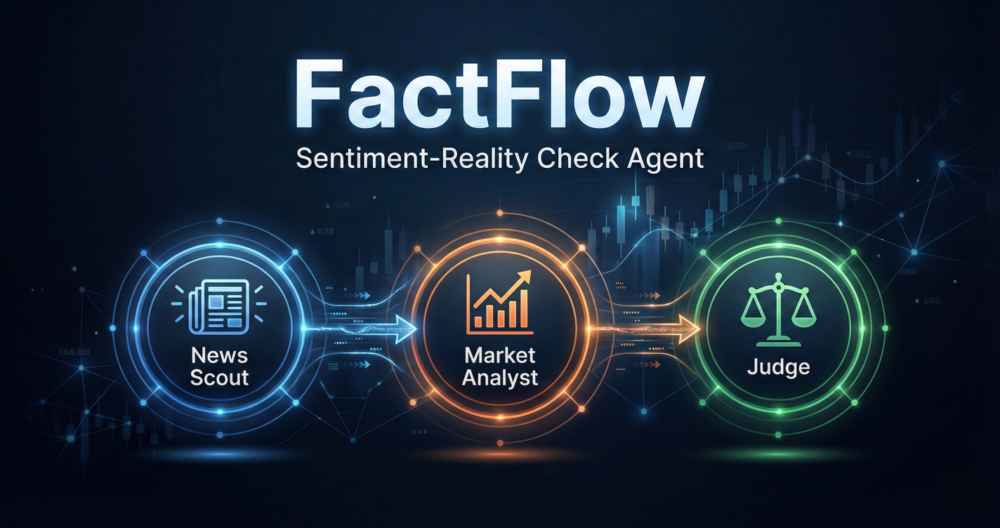
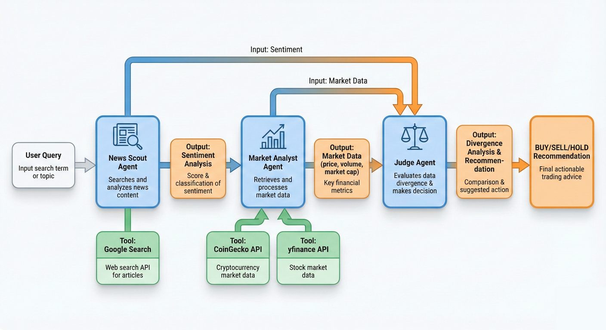
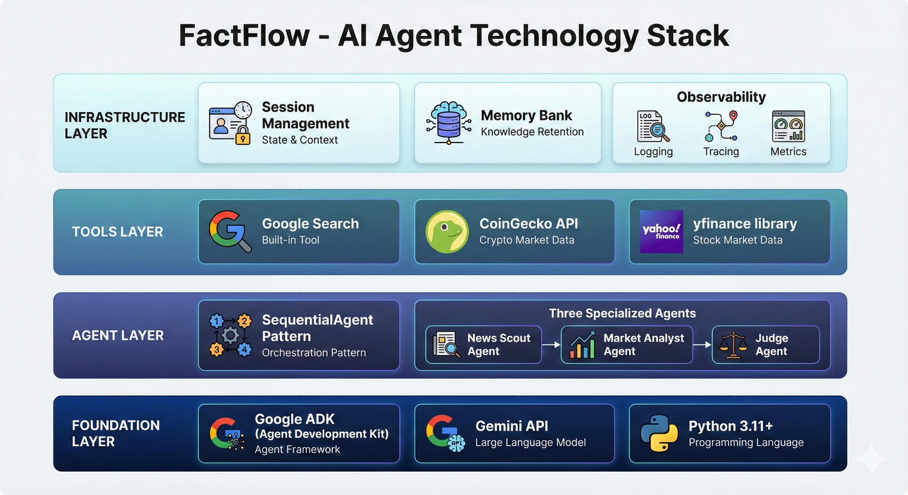
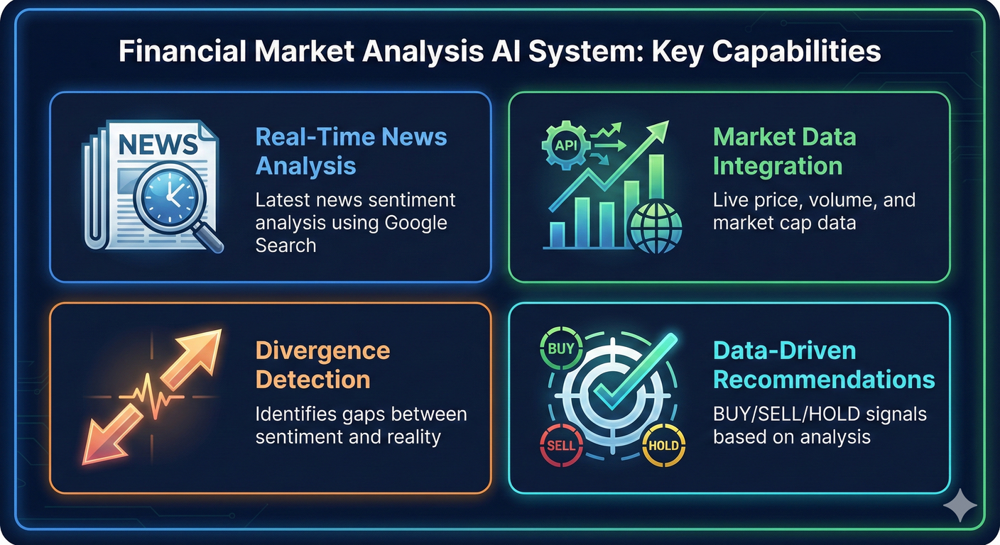

# FactFlow - Financial Market Sentiment-Reality Check Agent

<p align="center">
  
</p>


**FactFlow** is a multi-agent system that compares news sentiment with actual market price action to identify market inefficiencies. It protects users from "Fake News" dumps and "Hollow Hype" pumps by providing data-driven market analysis.

## 🎯 Project Overview

### Problem
Crypto and stock markets are plagued by emotional over-reactions. A scary headline can crash a price -5% even if the on-chain fundamentals haven't changed. Conversely, "hype" can pump a coin with zero volume support.

### Solution
FactFlow acts as a rational referee. It reads the news using Google Search and cross-references it with hard market data from APIs to identify divergences between sentiment and reality.

### Value Proposition
- **Bullish Divergence Detection**: When news is negative but price is stable (market ignoring bad news = strong holder confidence)
- **Bearish Divergence Detection**: When news is positive but price is dropping (weak fundamentals or selling pressure)
- **Data-Driven Recommendations**: Clear BUY/SELL/HOLD/ACCUMULATE signals based on divergence analysis

## 🏗️ Architecture

FactFlow uses a **Sequential Multi-Agent System** with three specialized agents:

<p align="center">
  
</p>

1. **News Scout Agent** - Analyzes news sentiment using Google Search
2. **Market Analyst Agent** - Fetches real-time market data (price, volume, market cap)
3. **Judge Agent** - Synthesizes findings and provides recommendations

```
User Query → News Scout → Market Analyst → Judge → Final Recommendation
```

## 🚀 Quick Start

### Prerequisites

- Python 3.11+
- Gemini API key from [Google AI Studio](https://aistudio.google.com/app/api-keys)

### Installation

1. Clone the repository:
```bash
git clone <repository-url>
cd factflow
```

2. Install dependencies:
```bash
pip install -r requirements.txt
```

3. Set up environment variables:
```bash
cp .env.example .env
# Edit .env and add your GEMINI_API_KEY
```

4. Run the agent:
```bash
python -m factflow.main "Assess Ethereum right now"
```

Or use the interactive mode:
```bash
python -m factflow.main
```

## 📚 Documentation

- **[SETUP.md](docs/SETUP.md)** - Detailed setup instructions
- **[USAGE.md](docs/USAGE.md)** - Usage guide and examples

## 🎓 Course Concepts Demonstrated

<p align="center">
  
</p>

This project demonstrates the following concepts from the 5-Day AI Agents Intensive Course:

✅ **Multi-agent System**: SequentialAgent pattern with 3 specialized agents  
✅ **Tools**: Google Search (built-in), Custom Function Tools (market data APIs)  
✅ **Sessions & Memory**: InMemorySessionService, Memory Bank for long-term storage  
✅ **Observability**: Logging, Tracing, Metrics collection  
✅ **Agent Evaluation**: LLM-as-a-Judge evaluation framework  
✅ **Deployment**: Vertex AI Agent Engine deployment configuration  

## 📁 Project Structure

```
factflow/
├── agents/              # Agent definitions
│   └── sentiment_agents.py
├── tools/               # Custom function tools
│   ├── market_tools.py
│   └── api_clients.py
├── session/             # Session & memory management
│   ├── session_manager.py
│   └── memory_service.py
├── observability/       # Logging, tracing, metrics
│   ├── logging_config.py
│   ├── tracing.py
│   └── metrics.py
├── evaluation/          # Agent evaluation framework
│   ├── evaluator.py
│   └── test_cases.py
├── deployment/          # Deployment configurations
│   └── deploy.py
├── notebooks/           # Demo notebooks
├── main.py              # Main entry point
└── requirements.txt     # Dependencies
```

## 🔧 Key Features

<p align="center">
  
</p>

- **Multi-Agent Architecture**: Sequential workflow with specialized agents
- **Real-Time Market Data**: Integration with CoinGecko and yfinance APIs
- **News Sentiment Analysis**: Google Search integration for latest news
- **Divergence Detection**: Identifies gaps between sentiment and price action
- **Session Management**: Stateful conversations with InMemorySessionService
- **Long-Term Memory**: Memory Bank for historical analysis storage
- **Observability**: Comprehensive logging, tracing, and metrics
- **Evaluation Framework**: LLM-as-a-Judge for quality assessment

## 📊 Example Usage

```python
from factflow import create_factflow_agent, FactFlowSessionManager

# Create agent
agent = create_factflow_agent()

# Create session manager
session_manager = FactFlowSessionManager()

# Get runner for a session
runner = session_manager.get_runner(session_id="user123")

# Run query
response = await runner.run("Assess Ethereum right now")
print(response.text)
```

## 🧪 Testing

Run the evaluation framework:
```bash
python evaluation/evaluator.py
```

## 📝 License

This project is part of the 5-Day AI Agents Intensive Course with Google.

## 🙏 Acknowledgments

- Google ADK (Agent Development Kit)
- Gemini API
- CoinGecko API (free tier)
- yfinance library

## 📧 Contact

For questions or issues, please create an issue in the repository.
